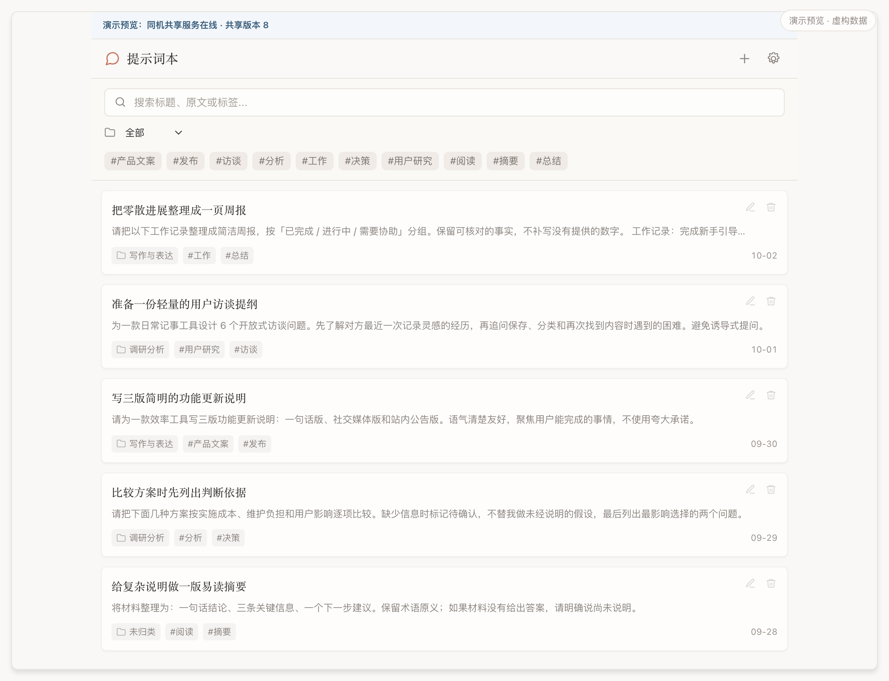
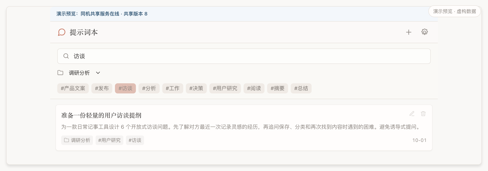
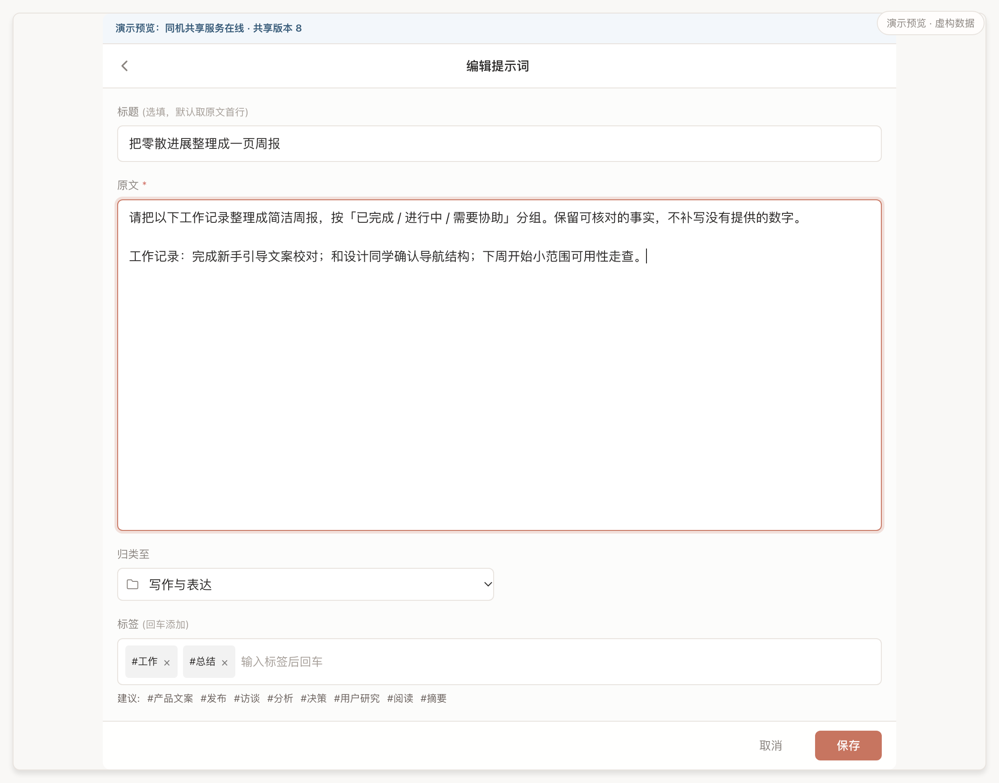
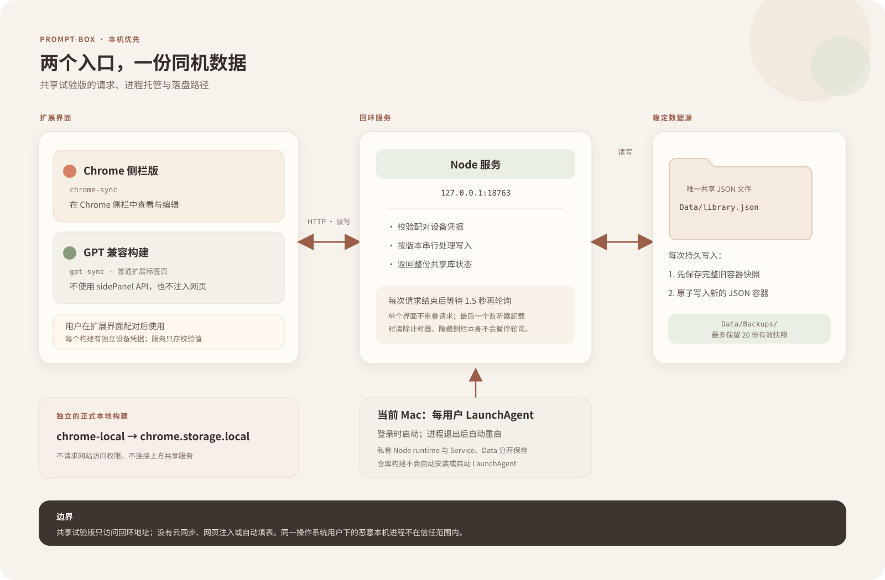

# Prompt-Box

**把好用的提示词留得住、找得回、拿得走。**

Prompt-Box 是一款中文 Chrome 扩展，围绕提示词的日常积累设计：保存、分类、搜索，最后由你决定复制到哪里使用。







> 三张图都由项目内的隔离预览加载真实 Vue 主界面生成，条目是虚构演示数据。预览只在内存中修改示例内容；图外的浅边框、圆角和阴影是展示装饰，不改实际界面。窄屏查看时可点图打开原尺寸。截图没有扩展管理页、真实提示词、账号信息或配对码。

## 为什么做

常用提示词容易散落在聊天记录、便签和文档里。需要复用时，往往要重新搜索、手动整理，或者凭记忆再写一遍。Prompt-Box 把这些片段收进一个轻量小本子，让分类和取用保持简单，也让用户清楚数据存在哪里。

## 适用场景

- 把反复使用的写作、总结、调研提示词集中保存。
- 用文件夹整理主题，再用标签交叉标记；筛选条件可以叠加。
- 在页面中选中一段文字，通过右键菜单保存为新条目。
- 需要时复制原文，再自行粘贴到任意工具中。
- 在 Chrome 侧栏里快速查看，或在不支持扩展侧栏的内置浏览器中用普通标签页打开主界面。

## 产品亮点

- **小而直接**：主流程只有记、分、取；列表、编辑和设置围绕提示词本身展开。
- **分类灵活**：一条提示词归属一个文件夹，也可以带多个标签。
- **编辑有保护**：保存时会核对打开编辑时的原记录；如果另一页面已修改或删除它，保留草稿并提示用户处理。
- **入口适配**：Chrome 侧栏构建继续使用侧栏；GPT 兼容构建不声明或调用 `sidePanel`，点扩展图标会打开普通标签页。两个共享构建的扩展名称均为 `Prompt-Box`。
- **分清数据源**：常规本地构建使用扩展自己的 `chrome.storage.local`。可选的同机共享构建需由用户配对，数据留在本机服务；扩展之间不会自动读取或迁移彼此的浏览器存储。
- **按需备份**：常规本地构建可导出 Markdown 供阅读；共享构建另提供 JSON 备份与预览后恢复。Markdown 不含可恢复的分类数据。

## 架构



正式本地构建 `chrome-local` 仍只使用扩展自己的 `chrome.storage.local`，不请求网站访问权限。同机共享是需要用户明确配对的隔离试验构建：Chrome 侧栏版和 GPT 兼容普通标签页版都连接本机回环服务 `127.0.0.1:18763`，共用一份 JSON 数据文件。它没有云端服务，也不会读取或迁移正式本地版数据。

当前 Mac 上另行批准配置了每用户 LaunchAgent：登录时启动，服务进程退出后由 launchd 重启；它使用 Application Support 目录中的独立 Node runtime、服务代码和数据。仓库构建不会安装或启动此配置。服务只监听 `127.0.0.1`，要求用户在扩展界面完成配对；每个扩展使用自己的设备凭据，服务只保存凭据校验值。持久写入前保存完整数据容器快照，自动备份最多保留 20 份。

每个已挂载的共享界面从初次读取开始轮询整份库；一次轮询完成后等待 1.5 秒再开始下一次，单个界面不会叠加轮询。最后一个数据监听器卸载时会清除计时器。当前实现没有根据窗口可见性暂停轮询，因此侧栏被遮住本身不代表轮询已停止。

代码依赖仍按单向分层组织：`entrypoints/` 负责挂载与事件接线，`ui/` 处理 Vue 渲染和状态编排，`infra/` 封装浏览器存储、剪贴板、导出及试验版服务适配，`domain/` 提供纯业务规则，`shared/` 存放通用常量和工具。`domain/` 不依赖浏览器 API、DOM 或 Vue；`tools/local-sync/` 的服务只绑定回环地址。

分层依赖由 `npm run check:arch` 检查。更多数据流与目录说明见 [MAP.md](./MAP.md)，跨工具工程规范见 [AGENTS.md](./AGENTS.md)。

## 本地运行

需要 Node.js 和 npm。

```bash
npm install
npm run verify
npm test
npm run build
```

常规本地版产物位于 `.output/chrome-local/chrome-mv3`。在 Chrome 扩展管理页开启开发者模式后，选择该目录加载未打包扩展。首次安装和更新时请保持加载目录及扩展身份稳定；更换目录不等同于迁移现有扩展数据。

同机共享构建为可选目标：

```bash
npm run build:sync
```

Chrome 侧栏和 GPT 标签页构建分别输出到 `.output/chrome-sync/chrome-mv3` 与 `.output/gpt-sync/chrome-mv3`。两者只请求 `http://127.0.0.1:18763/*`，并需用户在扩展界面完成一次性配对。开发环境可用 `npm run sync:start` 启动服务；请先检查 `AGENTS.md` 中关于隔离数据目录的说明。共享服务不上传数据，也不接受局域网连接。

若要更新既有构建，请使用对应原有扩展 ID 和密钥，并在扩展界面检查权限差异。不要用另一构建的输出目录替换本地版，也不要假定它们共享浏览器存储。

## 演示截图

```bash
npm run showcase:screenshot
```

脚本使用隔离的临时 Chrome 配置和虚构内存数据，加载项目真实的 `src/ui/sidepanel/App.vue`，通过界面控件生成主列表、组合筛选和编辑三张 2× 演示截图。脚本关闭后删除临时浏览器配置；它不会加载、读取或改写用户扩展数据，也不会打开扩展管理页。

## 数据与边界

- 不向 ChatGPT、Claude 或其他网站注入脚本，不自动填写输入框。
- 常规本地版不申请网站访问权限；同机共享构建只允许访问本机回环地址。
- 没有账号、云同步或社区提示词库；不上传用户数据。
- 常规本地版数据存放在对应扩展的 `chrome.storage.local` 中。共享构建数据存放在用户配置的本机服务目录，并与常规本地版分开。
- 迁移不会自动发生。JSON 恢复只作用于当前共享构建所连接的数据源；必须由用户选择备份文件、预览变化并确认。
- 同机服务以同一操作系统用户为信任边界；回环绑定不防御该用户运行的恶意本机进程。
- 界面目前使用简体中文。

## 技术栈

Vue 3、TypeScript、WXT、Vite；业务逻辑使用原生 composables，不依赖额外状态管理库。

```bash
npm run verify   # TypeScript + 架构检查
npm test         # 领域、存储适配与导出回归测试
npm run build    # 常规本地构建
npm run build:sync # 两种同机共享构建
```

## 来源

本项目参考 [Open Prompt Manager](https://github.com/jonathanbertholet/promptmanager)，并按本项目的本地优先边界重新组织。

## License

MIT
